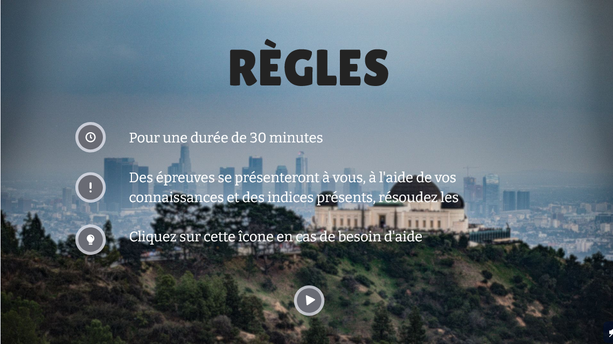

# s2.05-2.06

> Réalisé par Tas Atilla, Mirey Kellian, Aoulad-Tayab Karim

Dans cet escape game (intitulé "CS' Evolve" ou Computer Science Evolution) le joueur incarne une personne lambda qui se rend dans un musée qui retrace l’évolution de l’informatique. Arrivé face à l’IA qui était supposé lui raconter l’histoire de la science de l’informatique, il se retrouve à devoir apprendre, par lui-même, certains passages de l’histoire de l’informatique pour reconstruire la mémoire de cette dernière.

L’objectif du joueur est de rétablir les connaissances de l’IA en la reconnectant à internet et réalisant une série d’énigmes la guidant dans la récupération de ses données qui lui serviront dans un but ultime…

Le lien vers l'escape game juste [ici](https://view.genial.ly/63fe1d1070b155001137985b/interactive-content-cs-evolve-part-i).

### Règles

### Contributions de chaque membre de l'équipe

Tas Atilla :
- A réalisé le teaser, recherché une partie des scènes du trailer et la musique;
- A réalisé l’affiche de l’escape game;
- A écrit le pitch du teaser;
- A réalisé la partie d’introduction de l’escape game sur genially;

Mirey Kellian : 
- A réalisé les énigmes 1 et 3 de l’escape game, le déroulé global du jeu sur genially et la recherche d’images pour le jeu;
- A recherché une partie des scènes du teaser;
- A supervisé l’écriture du pitch et de la note d’intention;

Aoulad-Tayab Karim : 
- A écrit la note d’intention du teaser;
- A réalisé les énigmes 3 et 4 du jeu;